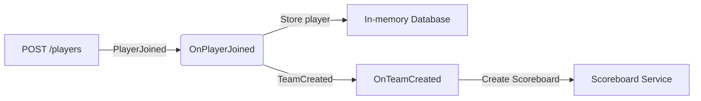

# Adding Middlewares

The term "middleware" describes functions that wrap the handlers with  additional logic either before or after the handler code.
This is the same concept as in HTTP middleware, but for Pub/Sub messages.

Watermill comes with some middleware that is ready to use. You can find the full list in the [documentation](https://watermill.io/docs/middlewares/).

Here's an example of middleware that times out the handler after a given time.

```go
router, err := message.NewRouter(message.RouterConfig{}, logger)
if err != nil {
	panic(err)
}

router.AddMiddleware(middleware.Timeout(time.Second * 10))

router.AddNoPublisherHandler(
	"handler", 
	"topic", 
	handler,
)
```

You can add multiple middleware functions to the Router. They will be executed in the order they were added.

One of the most useful middleware functions is the `Recoverer` middleware.
It catches panics in the handler and turns them into errors, so the service doesn't crash.

```go
router.AddMiddleware(middleware.Recoverer())
```

It's straightforward to write your own middleware. It's just a function that takes a handler and returns a handler.

Here's custom middleware that skips the handler for events with no name in the header.

```go
func SkipNoNameEvents(h message.HandlerFunc) message.HandlerFunc {
	return func(msg *message.Message) ([]*message.Message, error) {
		var header Header
		err := json.Unmarshal(msg.Payload, &header)
		if err != nil {
			return nil, err
		}
		
		if header.EventName == "" {
			fmt.Println("Skipping the event due to missing name")
			return nil, nil
		}
	
		return h(msg)
	}
}
```


<div class="alert alert-dismissible bg-light-primary d-flex flex-column flex-sm-row p-7 mb-10">
    <div class="d-flex flex-column">
        <h3 class="mb-5 text-dark">
			<svg xmlns="http://www.w3.org/2000/svg" width="16" height="16" fill="currentColor" class="bi bi-lightbulb text-primary" viewBox="0 0 16 16">
			  <path d="M2 6a6 6 0 1 1 10.174 4.31c-.203.196-.359.4-.453.619l-.762 1.769A.5.5 0 0 1 10.5 13a.5.5 0 0 1 0 1 .5.5 0 0 1 0 1l-.224.447a1 1 0 0 1-.894.553H6.618a1 1 0 0 1-.894-.553L5.5 15a.5.5 0 0 1 0-1 .5.5 0 0 1 0-1 .5.5 0 0 1-.46-.302l-.761-1.77a1.964 1.964 0 0 0-.453-.618A5.984 5.984 0 0 1 2 6zm6-5a5 5 0 0 0-3.479 8.592c.263.254.514.564.676.941L5.83 12h4.342l.632-1.467c.162-.377.413-.687.676-.941A5 5 0 0 0 8 1z"/>
			</svg>
			Tip
		</h3>
        <span>

Notice how the middleware unmarshals the payload into the `Header` struct.
This is a handy pattern that lets you access the header even if you don't know what type of event it is.
It works as long as all your headers are consistent.

</span>
	</div>
	</div>

### Correlation ID

A common use case for middleware is to pass the correlation ID between requests and messages.

The correlation ID is a unique string that allows you to track what happened across services and requests.
The easiest way is to append it to each log line. By searching for it in your log system, you can isolate
all logs related to the same request, regardless of how many services and API calls were involved.

Many HTTP APIs add it as a header. You can get the same effect with events by using the message metadata.

Watermill provides the middleware and some helper functions that should cover most use cases.
The middleware checks for any correlation ID in the incoming message's metadata and adds it to any new messages created by the handler.

```go
router.AddMiddleware(middleware.CorrelationID)
```

To add the middleware to a message's metadata:

```go
msg := message.NewMessage(watermill.NewUUID(), payload)
middleware.SetCorrelationID(correlationID, msg)
```

And to retrieve it:

```go
correlationID := middleware.MessageCorrelationID(msg)
```

## Exercise

File: `06-middlewares/01-add-middleware/main.go`

The provided code for this exercise is a part of a game engine backend.

The entry point is the `POST /players` HTTP endpoint, which publishes a `PlayerJoined` event.
In reaction to it, a message handler stores the player in an in-memory database.
If the player chooses a team that doesn't exist, the team is created and the `TeamCreated` event is published.
Finally, another message handler calls an external scoreboard service in reaction to a new team being created.



The code is missing a correlation ID, so it's hard to debug any issues.

Your task is to propagate the correlation ID from the HTTP request through all messages, 
up to the scoreboard HTTP request:

* Add the correlation middleware to the Router.
* Set the correlation ID for the `PlayerJoined` event based on the incoming correlation ID from the HTTP header.
* If the incoming correlation ID is empty, generate a new correlation ID; for example, a UUID.
* Pass the correlation ID from the `TeamCreated` event to the scoreboard request.
