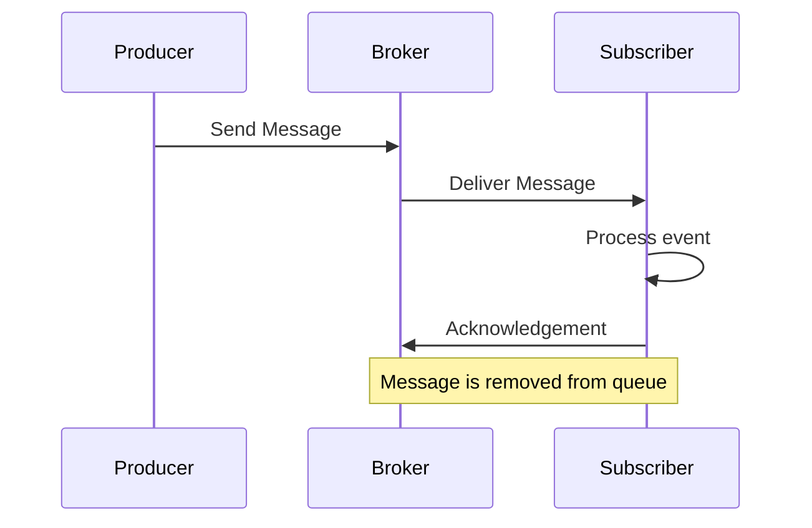
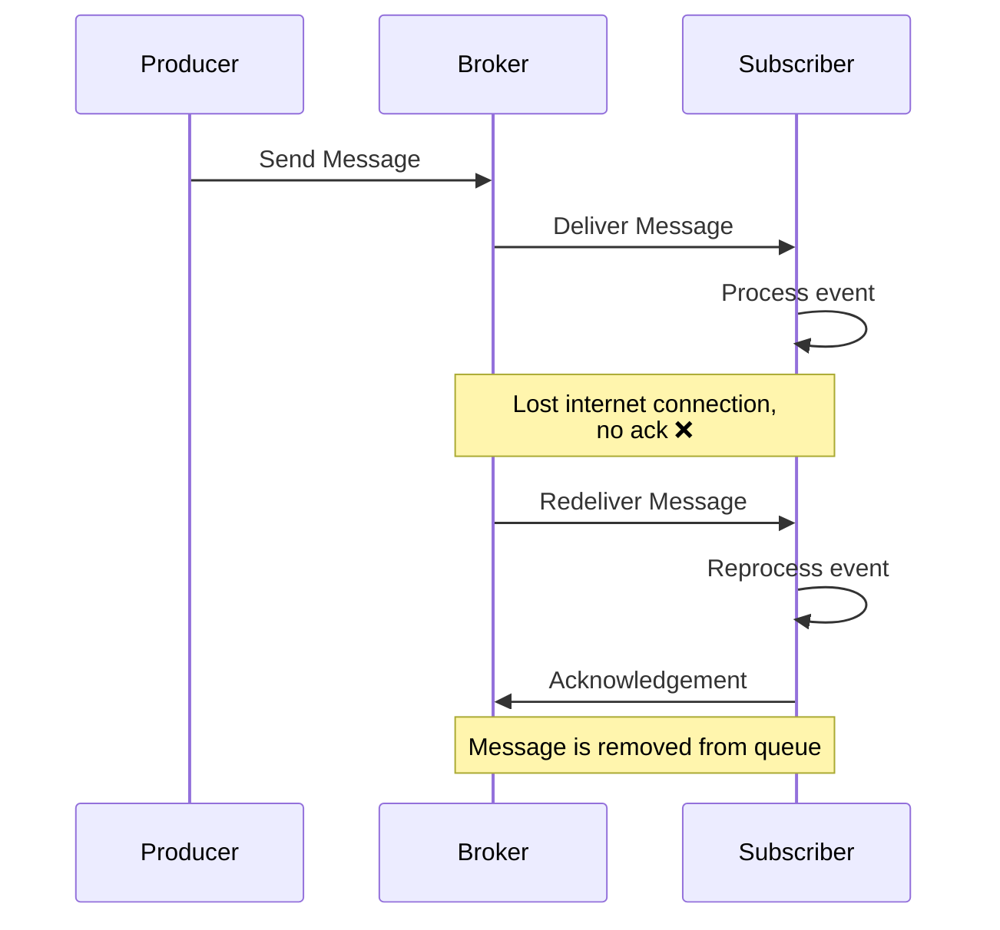

# Idempotent Event Handlers - handling at-least-once delivery

Every programming technique has its trade-offs.
We have already mentioned [eventual consistency](/trainings/go-event-driven/exercise/b5280cf2-87b1-4d6a-b406-8705314341b7).
Another trade-off that you need to keep in mind is the at-last-once message delivery guarantee.

If everything is fine, event-driven systems works like this:

However, what happens if our service loses its internet connection or crashes after processing the event but before acknowledgement? 

The message broker doesn't know if the message was processed but not acked or not processed at all.
To avoid this situation, when it was not processed _at least once_, it will redeliver the message.

This situation is not very likely to happen, but it's still possible, and 
it's important to keep it in mind when designing your system.
This may not be a big issue for some systems, but for some, it may be a big problem
(for example, sending a payment for $1 million twice).

    

        <h3 class="mb-5 text-dark">
			<svg xmlns="http://www.w3.org/2000/svg" width="16" height="16" fill="currentColor" class="bi bi-lightbulb text-primary" viewBox="0 0 16 16">
			  <path d="M2 6a6 6 0 1 1 10.174 4.31c-.203.196-.359.4-.453.619l-.762 1.769A.5.5 0 0 1 10.5 13a.5.5 0 0 1 0 1 .5.5 0 0 1 0 1l-.224.447a1 1 0 0 1-.894.553H6.618a1 1 0 0 1-.894-.553L5.5 15a.5.5 0 0 1 0-1 .5.5 0 0 1 0-1 .5.5 0 0 1-.46-.302l-.761-1.77a1.964 1.964 0 0 0-.453-.618A5.984 5.984 0 0 1 2 6zm6-5a5 5 0 0 0-3.479 8.592c.263.254.514.564.676.941L5.83 12h4.342l.632-1.467c.162-.377.413-.687.676-.941A5 5 0 0 0 8 1z"/>
			</svg>
			Tip
		</h3>
        

You might feel that asynchronous systems have  many trade-offs, but it's not the case that synchronous systems are better or worse 
— they are designed for solving different problems.
If you are applying them to the wrong problem, they may be indeed worse.

Synchronous architecture also has trade-offs: It's not scalable, extensible, or  fault-tolerant.
You just might not think about these issues because they are so common that you are used to them.

Don't use any system as a silver bullet: Use the right tool for the right job.

	

	

In practice, this is not that a big problem to deal with.
For some use cases it's not an issue at all; in other cases, you can use multiple techniques of deduplication.

The simplest way to do deduplication is to simply implement handlers that are _idempotent_.
Idempotent means that you can call the same function multiple times, and the result will be the same as calling it once.
For example, if you are handling `TicketBookingConfirmed` and the ticket already exists, you should do nothing.
Usually, you can handle such logic at the repository level.

Let's practice creating idempotent event handlers a bit.

## Exercise

File: `10-at-least-once-delivery/05-idempotent-event-handlers/main.go`

Things usually won't go well when you process a payment twice.

Modify `PaymentsRepository` so that it is idempotent.
You should use `PaymentID` as a unique payment identifier, which should be used for deduplication.

A duplicate is not unexpected situation, so you should not return an error (if you do, the message will spin forever).

Usually, if you want to do it in memory, it's good to use a map like `map[string]struct{}`, where `string` is the payment ID.
If you see that the key has already been used, you should not process the event.

    

        <h3 class="mb-5 text-dark">
			<svg xmlns="http://www.w3.org/2000/svg" width="16" height="16" fill="currentColor" class="bi bi-lightbulb text-primary" viewBox="0 0 16 16">
			  <path d="M2 6a6 6 0 1 1 10.174 4.31c-.203.196-.359.4-.453.619l-.762 1.769A.5.5 0 0 1 10.5 13a.5.5 0 0 1 0 1 .5.5 0 0 1 0 1l-.224.447a1 1 0 0 1-.894.553H6.618a1 1 0 0 1-.894-.553L5.5 15a.5.5 0 0 1 0-1 .5.5 0 0 1 0-1 .5.5 0 0 1-.46-.302l-.761-1.77a1.964 1.964 0 0 0-.453-.618A5.984 5.984 0 0 1 2 6zm6-5a5 5 0 0 0-3.479 8.592c.263.254.514.564.676.941L5.83 12h4.342l.632-1.467c.162-.377.413-.687.676-.941A5 5 0 0 0 8 1z"/>
			</svg>
			Tip
		</h3>
        

`map[string]struct{}` is a good way to store unique values in Go for three reasons:

1. It's memory efficient: `struct{}` is an empty struct, so it doesn't take any memory.
2. It's fast: Under the hood, it's a hash map.
3. It's easy to use.

	

	

