# Publishing Events Within a Transaction

To be able to handle bookings without Dead Nation, we need to be sure that we can replace their functionality on our side.
We need to find a way to send requests to Dead Nation during the transition period and keep the ticket limits.
After we finish the transition period, and we ensure that functionality works on our side, we'll be able to terminate our contract with Dead Nation.

The most important constraint is not allowing overbooking.
In practice, this should just mean that we have a table in which we count sold tickets and ensure within SQL transactions that we don't overbook.
After checking overbooking, we could call Dead Nation and voila.
Nothing complicated, right?
Well, it's not that easy.

Remember that Dead Nation is sometimes down when we are handling a big show?
They are not able to handle such high  traffic.
If they are down, nobody can buy a ticket.
**Because of that, we can't do a synchronous call to them.**

We are the only company that can sell tickets to all our shows, so we don't need a response from Dead Nation during booking.
If we are sure about the number of tickets left, we can sell them, emit a `BookingMade` event, and trigger a Dead Nation call via the `BookingMade` event.


This is a good idea, but it's not the end of the challanges.
Do you see a potential issue here?

Let's look at this scenario:


Let's see what can happen when the service dies (or loses its network connection).

Our transaction is committed, but we didn't emit the `BookingMade` event.
This means that we have a booking, but we didn't emit an event, so it won't be processed properly.

Maybe we could emit an event before committing a transaction?
Let's try:

```mermaid
sequenceDiagram
  participant Service
  participant Database
  participant PubSub

  
  Service->>Database: Start transaction
  activate Database

  Service->>Database: Check places left
  Database->>Service: 

  Service->>Database: Store ticket booking

  Service->>PubSub: Emit BookingMade emitted

  Note over Service: Service died 💥

  Service-xDatabase: Data is not committed
  deactivate Database
```



We emitted an event, but we didn't commit a transaction.
This means that it's likely that a person will receive a ticket. 
**However, we may have a situation where overbooking happens or two people have the same place.**

Now you can see one of the most common problems with event-driven systems.
At lower scale and in systems where data consistency is not that important, there's no problem.
However, with bigger systems — especially ones with high data consistency requirements — this may lead to serious problems that are hard to debug.

In the case of our ticketing system, it's a serious problem.
We've seen such a situation at a KISS concert: two people had the same place, and in the middle of the show, they needed 
to get out of the hall and resolve the problem.
Wouldn't you be angry if that happened to you?


<div class="alert alert-dismissible bg-light-primary d-flex flex-column flex-sm-row p-7 mb-10">
    <div class="d-flex flex-column">
        <h3 class="mb-5 text-dark">
			<svg xmlns="http://www.w3.org/2000/svg" width="16" height="16" fill="currentColor" class="bi bi-lightbulb text-primary" viewBox="0 0 16 16">
			  <path d="M2 6a6 6 0 1 1 10.174 4.31c-.203.196-.359.4-.453.619l-.762 1.769A.5.5 0 0 1 10.5 13a.5.5 0 0 1 0 1 .5.5 0 0 1 0 1l-.224.447a1 1 0 0 1-.894.553H6.618a1 1 0 0 1-.894-.553L5.5 15a.5.5 0 0 1 0-1 .5.5 0 0 1 0-1 .5.5 0 0 1-.46-.302l-.761-1.77a1.964 1.964 0 0 0-.453-.618A5.984 5.984 0 0 1 2 6zm6-5a5 5 0 0 0-3.479 8.592c.263.254.514.564.676.941L5.83 12h4.342l.632-1.467c.162-.377.413-.687.676-.941A5 5 0 0 0 8 1z"/>
			</svg>
			Tip
		</h3>
        <span>

Similar problems can also happen in similar scenarios, even if you are not using Pub/Sub.

In the diagram above, replace events with an HTTP call to an external service, and you will have the same problem.

</span>
	</div>
	</div>

### Outbox pattern

To solve this problem, we need to use a pattern called `Outbox`.
The idea is simple: We need to store events in the same transaction as data to the same database, and later forward them to Pub/Sub.

Wait, store events to the same database?
Correct! We'll store our events in PostgreSQL and forward them to the Pub/Sub later.


Forwarding can be done by a separate service or by the same service that does the business logic.
In our case, it will be within the same service.

It's not a problem when the service dies during the transaction: The event would be not committed together with the data.

What if the forwarder dies in the middle of publishing events?


As you can see, the event is republished. Is it a problem?
It shouldn't be, because our handlers [are idempotent](/trainings/go-event-driven/exercise/8c31d18a-b5ae-4d6a-9d1b-a057be5e4b2c)!


Let's implement a simple outbox.
We'll use a bit of Watermill's help to achieve it.


<div class="alert alert-dismissible bg-light-primary d-flex flex-column flex-sm-row p-7 mb-10">
    <div class="d-flex flex-column">
        <h3 class="mb-5 text-dark">
			<svg xmlns="http://www.w3.org/2000/svg" width="16" height="16" fill="currentColor" class="bi bi-lightbulb text-primary" viewBox="0 0 16 16">
			  <path d="M2 6a6 6 0 1 1 10.174 4.31c-.203.196-.359.4-.453.619l-.762 1.769A.5.5 0 0 1 10.5 13a.5.5 0 0 1 0 1 .5.5 0 0 1 0 1l-.224.447a1 1 0 0 1-.894.553H6.618a1 1 0 0 1-.894-.553L5.5 15a.5.5 0 0 1 0-1 .5.5 0 0 1 0-1 .5.5 0 0 1-.46-.302l-.761-1.77a1.964 1.964 0 0 0-.453-.618A5.984 5.984 0 0 1 2 6zm6-5a5 5 0 0 0-3.479 8.592c.263.254.514.564.676.941L5.83 12h4.342l.632-1.467c.162-.377.413-.687.676-.941A5 5 0 0 0 8 1z"/>
			</svg>
			Tip
		</h3>
        <span>

At first glance, this may sound like a simple task.
It's just inserting events and querying one by one and publishing them, right?
Yes, but the devil is in the details.

The biggest problem to handle is the situation where transactions are committed in a different order than they were started.
This leads to non-ordered message IDs, which makes consuming more difficult than sending messages one by one.
The problem is illustrated by [this test](https://github.com/ThreeDotsLabs/watermill-sql/blob/ea4d755fa8bb7a30cf252c0d5799dbebe2357731/pkg/sql/pubsub_test.go#L297).

</span>
	</div>
	</div>

For the sake of the training, we will use the Watermill SQL Pub/Sub.
The SQL Pub/Sub has the same interface as other Pub/Subs, with the difference that it's using a SQL database (PostgreSQL or MySQL) as its backend.


<div class="alert alert-dismissible bg-light-primary d-flex flex-column flex-sm-row p-7 mb-10">
    <div class="d-flex flex-column">
        <h3 class="mb-5 text-dark">
			<svg xmlns="http://www.w3.org/2000/svg" width="16" height="16" fill="currentColor" class="bi bi-lightbulb text-primary" viewBox="0 0 16 16">
			  <path d="M2 6a6 6 0 1 1 10.174 4.31c-.203.196-.359.4-.453.619l-.762 1.769A.5.5 0 0 1 10.5 13a.5.5 0 0 1 0 1 .5.5 0 0 1 0 1l-.224.447a1 1 0 0 1-.894.553H6.618a1 1 0 0 1-.894-.553L5.5 15a.5.5 0 0 1 0-1 .5.5 0 0 1 0-1 .5.5 0 0 1-.46-.302l-.761-1.77a1.964 1.964 0 0 0-.453-.618A5.984 5.984 0 0 1 2 6zm6-5a5 5 0 0 0-3.479 8.592c.263.254.514.564.676.941L5.83 12h4.342l.632-1.467c.162-.377.413-.687.676-.941A5 5 0 0 0 8 1z"/>
			</svg>
			Tip
		</h3>
        <span>

The SQL Pub/Sub has one interesting advantage: It's possible to use it as a replacement for a "real" message broker.
In some cases, due to technical (or political) limitations in your company, it's **not easily possible to 
deploy a message broker in your infrastructure.**

**In such cases, the SQL Pub/Sub can be used as a good replacement for a message broker.**
This can be a nice ice-breaker for introducing event-driven architecture into your company.
After you show that it's valuable, it can simplify the discussion about having a "real" message broker.

However, it may also be fine to just stay with the SQL Pub/Sub.
We know one famous company that is using just an SQL Pub/Sub in production, and they are happy with it.

</span>
	</div>
	</div>

For this and the next exercise, we'll use Watermill components.
It's up to you how you want to implement things in your project.
If you want, you can try to implement it from scratch.


<div class="alert alert-dismissible bg-light-primary d-flex flex-column flex-sm-row p-7 mb-10">
    <div class="d-flex flex-column">
        <h3 class="mb-5 text-dark">
			<svg xmlns="http://www.w3.org/2000/svg" width="16" height="16" fill="currentColor" class="bi bi-lightbulb text-primary" viewBox="0 0 16 16">
			  <path d="M2 6a6 6 0 1 1 10.174 4.31c-.203.196-.359.4-.453.619l-.762 1.769A.5.5 0 0 1 10.5 13a.5.5 0 0 1 0 1 .5.5 0 0 1 0 1l-.224.447a1 1 0 0 1-.894.553H6.618a1 1 0 0 1-.894-.553L5.5 15a.5.5 0 0 1 0-1 .5.5 0 0 1 0-1 .5.5 0 0 1-.46-.302l-.761-1.77a1.964 1.964 0 0 0-.453-.618A5.984 5.984 0 0 1 2 6zm6-5a5 5 0 0 0-3.479 8.592c.263.254.514.564.676.941L5.83 12h4.342l.632-1.467c.162-.377.413-.687.676-.941A5 5 0 0 0 8 1z"/>
			</svg>
			Tip
		</h3>
        <span>

It's possible to use Watermill SQL Pub/Sub for forwarding even in a non-Go codebase.
You can write a small service (in practice, no more than 50 lines of code) that will be responsible for forwarding and write code in any language you want to use to store events in the database.

</span>
	</div>
	</div>

Let's start with publishing events.

## Exercise

File: `11-outbox/04-publishing-event-in-transaction/main.go`

Implement the `PublishInTx` function:


```go
func PublishInTx(
	message *message.Message,
	tx *sql.Tx,
	logger watermill.LoggerAdapter,
) error {
```

It should use the [SQL Pub/Sub](https://watermill.io/pubsubs/sql/) for that.

You need to create a publisher instance for the provided transaction.
You should use `watermillSQL.DefaultPostgreSQLSchema{}` as the schema adapter:

```go
publisher, err := watermillSQL.NewPublisher(
    db,
    watermillSQL.PublisherConfig{
        SchemaAdapter: watermillSQL.DefaultPostgreSQLSchema{},
    },
    logger,
)
```


<div class="alert alert-dismissible bg-light-primary d-flex flex-column flex-sm-row p-7 mb-10">
    <div class="d-flex flex-column">
        <h3 class="mb-5 text-dark">
			<svg xmlns="http://www.w3.org/2000/svg" width="16" height="16" fill="currentColor" class="bi bi-lightbulb text-primary" viewBox="0 0 16 16">
			  <path d="M2 6a6 6 0 1 1 10.174 4.31c-.203.196-.359.4-.453.619l-.762 1.769A.5.5 0 0 1 10.5 13a.5.5 0 0 1 0 1 .5.5 0 0 1 0 1l-.224.447a1 1 0 0 1-.894.553H6.618a1 1 0 0 1-.894-.553L5.5 15a.5.5 0 0 1 0-1 .5.5 0 0 1 0-1 .5.5 0 0 1-.46-.302l-.761-1.77a1.964 1.964 0 0 0-.453-.618A5.984 5.984 0 0 1 2 6zm6-5a5 5 0 0 0-3.479 8.592c.263.254.514.564.676.941L5.83 12h4.342l.632-1.467c.162-.377.413-.687.676-.941A5 5 0 0 0 8 1z"/>
			</svg>
			Tip
		</h3>
        <span>

It may look strange initially that we are calling the publisher constructor for each transaction.

However, if we want to publish an event within a transaction, the publisher needs to be _transaction-aware_.
We wanted to keep the publisher interface compatible with the standard Watermill publisher interface.
We achieved this by creating a new publisher instance for each transaction.

It's not an issue in practice — it has no side effects and is designed to be fast enough. 

</span>
	</div>
	</div>

After that, you should publish the provided message to **the topic `ItemAddedToCart`.**
