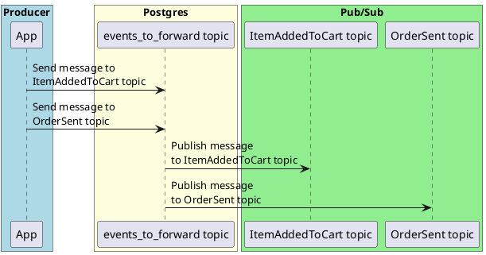

# Publishing events within transaction with forwarder

In addition to what we've done so far, we want to use a Watermill component called the `Forwarder`. 
It wraps published messages into an envelope, thanks to which **we can publish messages to multiple topics and forward from one topic.**
For example, we can have a service that publishes the `ItemAddedToCart` and `OrderSent` events. They are both enveloped and sent to the `events_to_forward` topic.
Then we can have a service that is subscribed to the `events_to_forward` topic, and it will receive both the `ItemAddedToCart` and `OrderSent` events.

Here is how an example envelope looks:

```json
{
  "destination_topic": "events_to_forward",
  "uuid": "c0873c7c-ba53-4236-8fdd-f63c7ef8aa79",
  "payload": "SXRlbUFkZGVkVG9DYXJ0",
  "metadata": {}
}
```
At a high level, this is what the topics topology looks like:




This makes the management of topics easier, because to forward messages, you don't need to subscribe to all topics, only one.
It's not necessary to use this component, but we'll do so for simplicity.

To make the forwarder's enveloping work, you need to wrap your publisher with the forwarder's publisher:

```go
package main

import (
	"database/sql"
	"fmt"

	"github.com/ThreeDotsLabs/watermill"
	watermillSQL "github.com/ThreeDotsLabs/watermill-sql/v2/pkg/sql"
	"github.com/ThreeDotsLabs/watermill/components/forwarder"
	"github.com/ThreeDotsLabs/watermill/message"

	_ "github.com/lib/pq"
)

var outboxTopic = "events_to_forward"

func PublishInTx(
	msg *message.Message,
	tx *sql.Tx,
	logger watermill.LoggerAdapter,
) error {
	// (create publisher) ... 

	publisher = forwarder.NewPublisher(publisher, forwarder.PublisherConfig{
		ForwarderTopic: outboxTopic,
	})

	// (publish message) ...
}

```

Then use this publisher to publish the message to the `ItemAddedToCart` topic.
The forwarder will wrap the message and publish it to the `events_to_forward` topic.


<div class="alert alert-dismissible bg-light-primary d-flex flex-column flex-sm-row p-7 mb-10">
    <div class="d-flex flex-column">
        <h3 class="mb-5 text-dark">
			<svg xmlns="http://www.w3.org/2000/svg" width="16" height="16" fill="currentColor" class="bi bi-lightbulb text-primary" viewBox="0 0 16 16">
			  <path d="M2 6a6 6 0 1 1 10.174 4.31c-.203.196-.359.4-.453.619l-.762 1.769A.5.5 0 0 1 10.5 13a.5.5 0 0 1 0 1 .5.5 0 0 1 0 1l-.224.447a1 1 0 0 1-.894.553H6.618a1 1 0 0 1-.894-.553L5.5 15a.5.5 0 0 1 0-1 .5.5 0 0 1 0-1 .5.5 0 0 1-.46-.302l-.761-1.77a1.964 1.964 0 0 0-.453-.618A5.984 5.984 0 0 1 2 6zm6-5a5 5 0 0 0-3.479 8.592c.263.254.514.564.676.941L5.83 12h4.342l.632-1.467c.162-.377.413-.687.676-.941A5 5 0 0 0 8 1z"/>
			</svg>
			Tip
		</h3>
        <span>

We don't want to make this training too Watermill-oriented, but on the other hand, not using Watermill would slow you down a lot in implementing the project.
If you don't want to depend on Watermill in your projects, you can implement your own version of the `Forwarder` component.
It makes sense if you have more custom needs.

The entire code of the Forwarder component is on the Watermill [GitHub](https://github.com/ThreeDotsLabs/watermill/tree/master/components/forwarder)

In real life, we recommend starting with Watermill's components and replacing them with custom ones if needed.
We made everything modular enough that you can easily replace any of the parts.

What's most important for us is to explain how it works under the hood, so you deeply understand this concept.
You won't then depend on Watermill or Go to use it.

</span>
	</div>
	</div>

## Exercise

File: `11-outbox/06-publishing-event-for-forwarder/main.go`

Implement `PublishInTx`, which uses the `Forwarder` to publish messages to PostgreSQL Pub/Sub.

```go
func PublishInTx(
	msg *message.Message,
	tx *sql.Tx,
	logger watermill.LoggerAdapter,
) error {
```

Leave the following line in your `main.go` — it's used by tests to know which topic to use for forwarding.
The `ForwarderTopic` option of forwarder should be set to `outboxTopic`. 

```go
var outboxTopic = "events_to_forward"
```

Tests will try to publish a message and check if it's forwarded to the Redis Pub/Sub.


<div class="alert alert-dismissible bg-light-primary d-flex flex-column flex-sm-row p-7 mb-10">
    <div class="d-flex flex-column">
        <h3 class="mb-5 text-dark">
			<svg xmlns="http://www.w3.org/2000/svg" width="16" height="16" fill="currentColor" class="bi bi-lightbulb text-primary" viewBox="0 0 16 16">
			  <path d="M2 6a6 6 0 1 1 10.174 4.31c-.203.196-.359.4-.453.619l-.762 1.769A.5.5 0 0 1 10.5 13a.5.5 0 0 1 0 1 .5.5 0 0 1 0 1l-.224.447a1 1 0 0 1-.894.553H6.618a1 1 0 0 1-.894-.553L5.5 15a.5.5 0 0 1 0-1 .5.5 0 0 1 0-1 .5.5 0 0 1-.46-.302l-.761-1.77a1.964 1.964 0 0 0-.453-.618A5.984 5.984 0 0 1 2 6zm6-5a5 5 0 0 0-3.479 8.592c.263.254.514.564.676.941L5.83 12h4.342l.632-1.467c.162-.377.413-.687.676-.941A5 5 0 0 0 8 1z"/>
			</svg>
			Tip
		</h3>
        <span>

In this scenario, you should still call `Publish("ItemAddedToCart", msg)` in your publisher.
Publishing to `events_to_forward` is done by the forwarder transparently.

</span>
	</div>
	</div>
