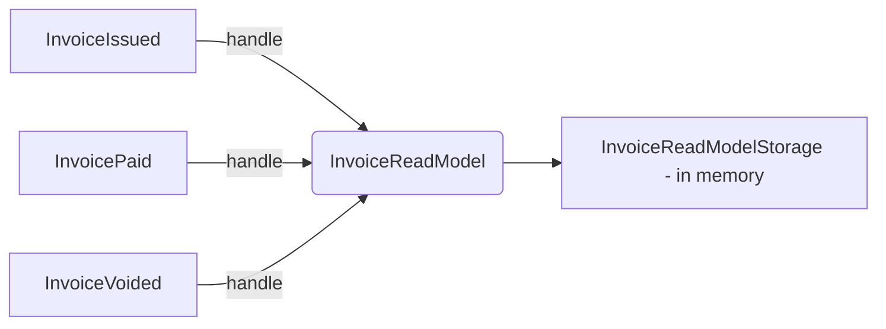

# Read Models

### Building read models

So is it time for an exercise? Not yet!
Building read models is one of those techniques which are easy to learn, but hard to master.
Here's some arcane knowledge that will help you to build better read models.

### Implementation details

**To build a read model, you should consume all events with data that you need.
You should then store the data in a format that is optimized for your use case reads... and that's it!**

While building a read model, you should keep the logic as simple as possible.
Let's imagine a scenario, where you want to have a read model of an invoice.
**You shouldn't sum all payment values and decide when the invoice was paid when the sum of payments equals to the amount to be paid on invoice.**
This logic should not be spread across multiple places in your system.
**If in the future we'll add some extra requirements for invoice to decide that it was fully paid, it will be a nightmare to find all places which are calculating it.**
**Information if invoice was paid, should be calculated in a place where write model exists.**
It's better to just add a flag like `FullyPaid` in the `InvoicePaymentReceived` event.


<div class="alert alert-dismissible bg-light-primary d-flex flex-column flex-sm-row p-7 mb-10">
    <div class="d-flex flex-column">
        <h3 class="mb-5 text-dark">
			<svg xmlns="http://www.w3.org/2000/svg" width="16" height="16" fill="currentColor" class="bi bi-lightbulb text-primary" viewBox="0 0 16 16">
			  <path d="M2 6a6 6 0 1 1 10.174 4.31c-.203.196-.359.4-.453.619l-.762 1.769A.5.5 0 0 1 10.5 13a.5.5 0 0 1 0 1 .5.5 0 0 1 0 1l-.224.447a1 1 0 0 1-.894.553H6.618a1 1 0 0 1-.894-.553L5.5 15a.5.5 0 0 1 0-1 .5.5 0 0 1 0-1 .5.5 0 0 1-.46-.302l-.761-1.77a1.964 1.964 0 0 0-.453-.618A5.984 5.984 0 0 1 2 6zm6-5a5 5 0 0 0-3.479 8.592c.263.254.514.564.676.941L5.83 12h4.342l.632-1.467c.162-.377.413-.687.676-.941A5 5 0 0 0 8 1z"/>
			</svg>
			Tip
		</h3>
        <span>

When building a read model, you should not perform any business rules validations.
You are building it based on events, which are facts.
If you received information that a ticket was printed, you should not check if there are enough spots available.
**This logic should be handled by the write model.**

The only exception is when you are building a read model which responsibility is to validate some data.

It's fine to do some sanity checks in the data that you are receiving from events (so you can avoid propagating invalid data further).
When you see that an event without some important data arrives, you can nack that event.
We'll cover it a bit later in the training.

</span>
	</div>
	</div>


<div class="alert alert-dismissible bg-light-primary d-flex flex-column flex-sm-row p-7 mb-10">
    <div class="d-flex flex-column">
        <h3 class="mb-5 text-dark">
			<svg xmlns="http://www.w3.org/2000/svg" width="16" height="16" fill="currentColor" class="bi bi-lightbulb text-primary" viewBox="0 0 16 16">
			  <path d="M2 6a6 6 0 1 1 10.174 4.31c-.203.196-.359.4-.453.619l-.762 1.769A.5.5 0 0 1 10.5 13a.5.5 0 0 1 0 1 .5.5 0 0 1 0 1l-.224.447a1 1 0 0 1-.894.553H6.618a1 1 0 0 1-.894-.553L5.5 15a.5.5 0 0 1 0-1 .5.5 0 0 1 0-1 .5.5 0 0 1-.46-.302l-.761-1.77a1.964 1.964 0 0 0-.453-.618A5.984 5.984 0 0 1 2 6zm6-5a5 5 0 0 0-3.479 8.592c.263.254.514.564.676.941L5.83 12h4.342l.632-1.467c.162-.377.413-.687.676-.941A5 5 0 0 0 8 1z"/>
			</svg>
			Tip
		</h3>
        <span>

**Keep in mind, that read models are eventually consistent.
It means that they are not updated in real time, but with some delay.**
It usually should be sub-second delay that is not visible for the user.
It's the tradeoff that we are making to make our system more scalable and resilient.

Because of that, using read models may be not only a technical decision - it may have a huge impact on how business is working.
You may want to discuss it with business stakeholders.

One tip how to ask about that in a right way: never ask if the data needs to be consistent
in real time - business will always say that it needs.
Instead, ask them if booking a ticket should fail if we were not able to update read model for operations, or it's
better to update it with a small delay.
It shows nicely how important it is to ask questions properly and explain the tradeoffs.

Such technical decisions can have a huge impact on the business side - so we should not make it without consulting
it with the business stakeholders.

</span>
	</div>
	</div>

Normally, it's not a good idea to return complex models directly from the database in API.
It's the source of very tight coupling.
It's hard to evolve the database model, because all the changes will be propagated to the API.
(Even if they are not intended to be returned.) And vice versa - not all data from the API should be stored in the database.


<div class="alert alert-dismissible bg-light-primary d-flex flex-column flex-sm-row p-7 mb-10">
    <div class="d-flex flex-column">
        <h3 class="mb-5 text-dark">
			<svg xmlns="http://www.w3.org/2000/svg" width="16" height="16" fill="currentColor" class="bi bi-lightbulb text-primary" viewBox="0 0 16 16">
			  <path d="M2 6a6 6 0 1 1 10.174 4.31c-.203.196-.359.4-.453.619l-.762 1.769A.5.5 0 0 1 10.5 13a.5.5 0 0 1 0 1 .5.5 0 0 1 0 1l-.224.447a1 1 0 0 1-.894.553H6.618a1 1 0 0 1-.894-.553L5.5 15a.5.5 0 0 1 0-1 .5.5 0 0 1 0-1 .5.5 0 0 1-.46-.302l-.761-1.77a1.964 1.964 0 0 0-.453-.618A5.984 5.984 0 0 1 2 6zm6-5a5 5 0 0 0-3.479 8.592c.263.254.514.564.676.941L5.83 12h4.342l.632-1.467c.162-.377.413-.687.676-.941A5 5 0 0 0 8 1z"/>
			</svg>
			Tip
		</h3>
        <span>

You can read about this problem in depth in our [Business Applications in Go: Things to know about DRY](https://threedots.tech/post/things-to-know-about-dry/) article.

</span>
	</div>
	</div>

But Read Models are different - they are used **just** for reading.
Thanks to that, we can return this data directly from the API without sacrificing maintainability.
**Change of the format will affect only the API, but there is no other part of the application that depends on that format.**
It's because read models are not write models _(thanks, Captain Obvious!)_.
They don't keep track of any invariants or the domain code.

Such shortcut simplifies our code and makes it extremely performant - you do just one lookup of the
database and return the data without any post-processing or joins.
It's also very easy to scale it horizontally and geographically if needed.

This is also a very good and less complex alternative to using GraphQL.
You can prepare a read model with all needed data and return it directly from the API.
It's not a silver bullet compared to GraphQL, but in some cases it may be much faster, more resilient and even less complicated.

## Exercise

File: `13-read-models/02-building-read-models/main.go`

It's been a lot of theory, time to do some coding!
Don't be scared - the entry level for read models is very low.

Let's start with an exercise which is outside the project.

Your goal is to implement a read model in application that supports 3 events:

- `InvoiceIssued`,
- `InvoicePaymentReceived`,
- `InvoiceVoided`.

As output, you should build a read model:

```go
type InvoiceReadModel struct {
	InvoiceID    string
	
	// This data is sent via InvoiceIssued
	CustomerName string 
	Amount       decimal.Decimal
	IssuedAt     time.Time

	// This data is sent via InvoicePaymentReceived
	FullyPaid     bool // This should be set to true, if InvoicePaymentReceived.FullyPaid is true
	PaidAmount    decimal.Decimal // This should be the sum of all payments from InvoicePaymentReceived
	LastPaymentAt time.Time // This should be the maximum value from InvoicePaymentReceived.PaidAt

	// This data is sent via InvoiceVoided
	Voided   bool // This should be set to true when event InvoiceVoided arrives
	VoidedAt time.Time // This should be the maximum value from InvoiceVoided.VoidedAt
}
```

We'll store the read model in memory. We'll use `InvoiceReadModelStorage` for that.



Tests are using `InvoiceReadModelStorage.Invoices()`, which should return all invoices from the read model.

As part of this exercise, in `NewRouter` you should add your event handlers that will trigger proper method in `InvoiceReadModelStorage`.
You need to also implement missing methods of `InvoiceReadModelStorage`: `InvoiceByID`, `OnInvoiceIssued`, `OnInvoicePaymentReceived`.

During implementing the solution, don't forget about [idempotency](/trainings/go-event-driven/exercise/8c31d18a-b5ae-4d6a-9d1b-a057be5e4b2c)!

`InvoiceIssued` can be deduplicated based on `InvoiceID` and `InvoicePaymentReceived` can be deduplicated based on `PaymentID`.
You can't de-duplicate `InvoicePaymentReceived` on `InvoiceID` because you can have multiple payments for the same invoice - and
this is a valid scenario.

`PaidAmount` in the read model should be increased by the amount of the payment, but only once per `PaymentID`
from `InvoicePaymentReceived`. In other words - you should de-duplicate `InvoicePaymentReceived` based on `PaymentID`.

As mentioned earlier, you should not decide if the invoice was paid based on the sum of payments.
Instead, you should use `InvoicePaymentReceived.FullyPaid` flag.


<div class="alert alert-dismissible bg-light-primary d-flex flex-column flex-sm-row p-7 mb-10">
    <div class="d-flex flex-column">
        <h3 class="mb-5 text-dark">
			<svg xmlns="http://www.w3.org/2000/svg" width="16" height="16" fill="currentColor" class="bi bi-lightbulb text-primary" viewBox="0 0 16 16">
			  <path d="M2 6a6 6 0 1 1 10.174 4.31c-.203.196-.359.4-.453.619l-.762 1.769A.5.5 0 0 1 10.5 13a.5.5 0 0 1 0 1 .5.5 0 0 1 0 1l-.224.447a1 1 0 0 1-.894.553H6.618a1 1 0 0 1-.894-.553L5.5 15a.5.5 0 0 1 0-1 .5.5 0 0 1 0-1 .5.5 0 0 1-.46-.302l-.761-1.77a1.964 1.964 0 0 0-.453-.618A5.984 5.984 0 0 1 2 6zm6-5a5 5 0 0 0-3.479 8.592c.263.254.514.564.676.941L5.83 12h4.342l.632-1.467c.162-.377.413-.687.676-.941A5 5 0 0 0 8 1z"/>
			</svg>
			Tip
		</h3>
        <span>

In tests we are using the [`github.com/google/go-cmp/cmp`](https://github.com/google/go-cmp/cmp) library. 
It's useful for comparing complex structures.
It also generates nice diffs.

</span>
	</div>
	</div>


<div class="alert alert-dismissible bg-light-primary d-flex flex-column flex-sm-row p-7 mb-10">
    <div class="d-flex flex-column">
        <h3 class="mb-5 text-dark">
			<svg xmlns="http://www.w3.org/2000/svg" width="16" height="16" fill="currentColor" class="bi bi-lightbulb text-primary" viewBox="0 0 16 16">
			  <path d="M2 6a6 6 0 1 1 10.174 4.31c-.203.196-.359.4-.453.619l-.762 1.769A.5.5 0 0 1 10.5 13a.5.5 0 0 1 0 1 .5.5 0 0 1 0 1l-.224.447a1 1 0 0 1-.894.553H6.618a1 1 0 0 1-.894-.553L5.5 15a.5.5 0 0 1 0-1 .5.5 0 0 1 0-1 .5.5 0 0 1-.46-.302l-.761-1.77a1.964 1.964 0 0 0-.453-.618A5.984 5.984 0 0 1 2 6zm6-5a5 5 0 0 0-3.479 8.592c.263.254.514.564.676.941L5.83 12h4.342l.632-1.467c.162-.377.413-.687.676-.941A5 5 0 0 0 8 1z"/>
			</svg>
			Tip
		</h3>
        <span>

Do not store money in floats. Never. Use decimals instead.
For example from the [`github.com/shopspring/decimal`](github.com/shopspring/decimal) library.

We covered this topic in detail
in [The Go libraries that never failed us: 22 libraries you need to know](https://threedots.tech/post/list-of-recommended-libraries/#misc)
article.

</span>
	</div>
	</div>


<div class="alert alert-dismissible bg-light-primary d-flex flex-column flex-sm-row p-7 mb-10">
    <div class="d-flex flex-column">
        <h3 class="mb-5 text-dark">
			<svg xmlns="http://www.w3.org/2000/svg" width="16" height="16" fill="currentColor" class="bi bi-lightbulb text-primary" viewBox="0 0 16 16">
			  <path d="M2 6a6 6 0 1 1 10.174 4.31c-.203.196-.359.4-.453.619l-.762 1.769A.5.5 0 0 1 10.5 13a.5.5 0 0 1 0 1 .5.5 0 0 1 0 1l-.224.447a1 1 0 0 1-.894.553H6.618a1 1 0 0 1-.894-.553L5.5 15a.5.5 0 0 1 0-1 .5.5 0 0 1 0-1 .5.5 0 0 1-.46-.302l-.761-1.77a1.964 1.964 0 0 0-.453-.618A5.984 5.984 0 0 1 2 6zm6-5a5 5 0 0 0-3.479 8.592c.263.254.514.564.676.941L5.83 12h4.342l.632-1.467c.162-.377.413-.687.676-.941A5 5 0 0 0 8 1z"/>
			</svg>
			Tip
		</h3>
        <span>

What you should do if you receive `OnInvoicePaymentReceived` before `OnInvoiceIssued`?
You definitely shouldn't do nothing and return `nil` - you'll lose data from `OnInvoiceIssued`.
If you depend on the data from the previous event, you should return an error and the event will be re-delivered.

It's a general rule that you should apply to read models.

</span>
	</div>
	</div>
